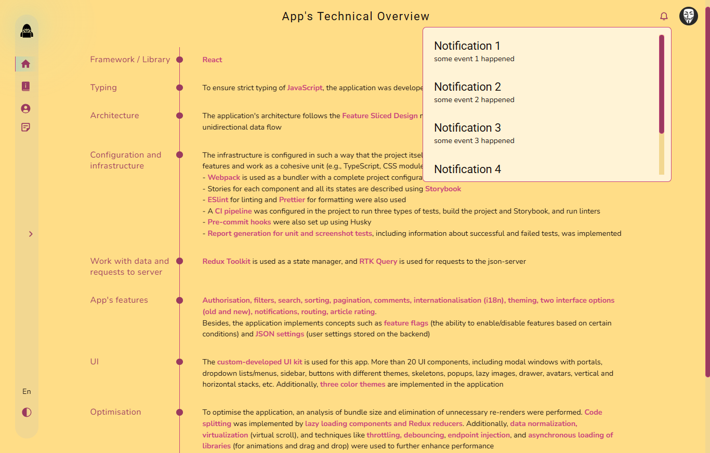
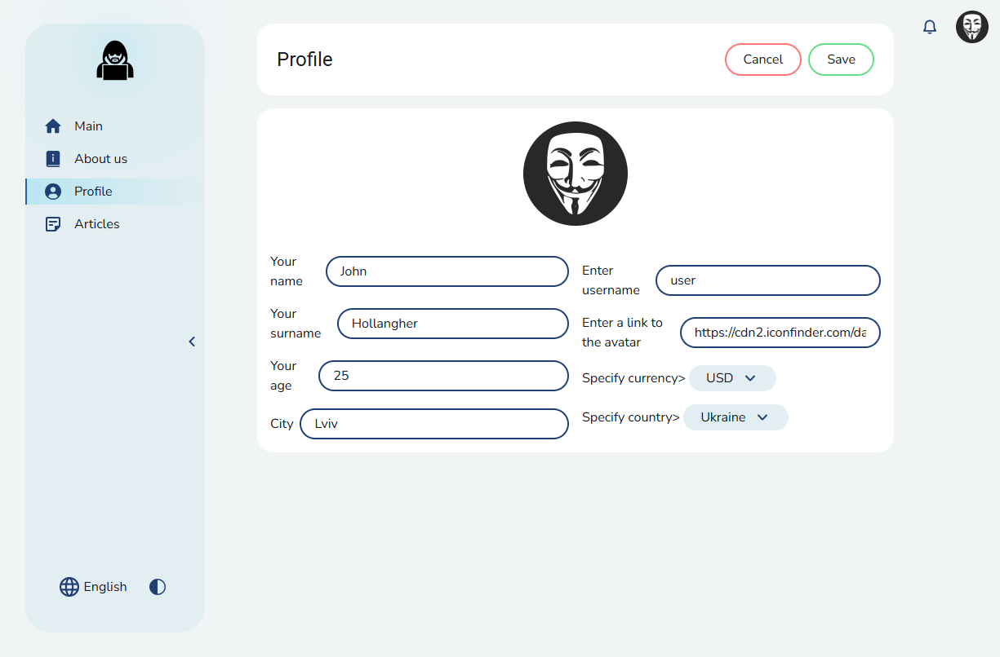
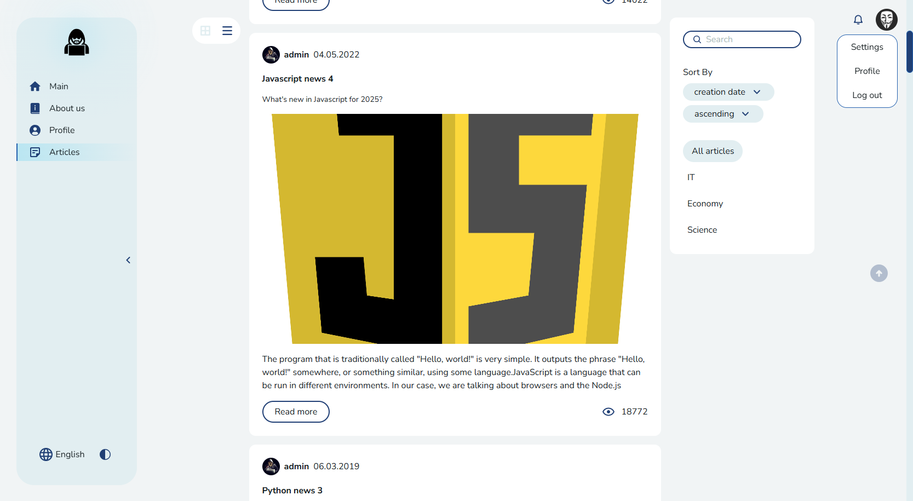

# Tech News Platform

A React + TypeScript content management platform built to demonstrate modern frontend architecture and engineering practices.

## Live Demo

https://it-tech-blog.netlify.app

## Key features:

- Authentication & authorization
- Article management
- Internationalisation (i18n)
- Feature flags
- Commenting and rating articles
- Theme switching
- Notifications
- Advanced filtering, sorting and pagination
- Custom UI Kit
- Comprehensive testing
- Storybook

## Screenshots

### Main Page



### Profile Editing



### Articles Page



## Tech Stack

- React + TypeScript
- Redux Toolkit + RTK Query
- Feature-Sliced Design (FSD)
- Storybook
- Jest + React Testing Library + Loki + Cypress
- i18next
- Webpack + Vite

## Getting Started

```bash
npm install

npm run start:dev
# or

npm run start:dev:vite
```

----

## Scripts

- `npm run start` - Start frontend on webpack dev server
- `npm run start:vite` - Start frontend on vite
- `npm run start:dev` - Start frontend (webpack) + backend server
- `npm run start:dev:vite` - Start frontend (vite) + backend server
- `npm run start:dev:server` - Start backend server only
- `npm run build:prod` - Build project in production mode
- `npm run build:dev` - Build project in development mode (not minified)
- `npm run lint:ts` - Lint TypeScript files
- `npm run lint:ts:fix` - Fix lint errors in TypeScript files
- `npm run lint:scss` - Lint SCSS style files
- `npm run lint:scss:fix` - Fix lint errors in SCSS files
- `npm run test:unit` - Run unit tests with Jest
- `npm run test:ui` - Run visual regression tests with Loki
- `npm run test:ui:ok` - Approve new visual snapshots
- `npm run test:ui:ci` - Run visual tests in CI
- `npm run test:ui:report` - Generate full report for UI tests
- `npm run test:ui:json` - Generate JSON report for UI tests
- `npm run test:ui:html` - Generate HTML report for UI tests
- `npm run storybook` - Start Storybook
- `npm run storybook:build` - Build Storybook
- `npm run prepare` - Pre-commit hooks
- `npm run generate:slice` - Script to generate FSD slices

----

## Project Architecture

The project follows Feature-Sliced Design (FSD), providing clear separation of responsibilities and scalable application structure.

Documentation link: [feature sliced design](https://feature-sliced.design/docs/get-started/tutorial)

----

## Working with Translations

This project uses i18next for localization.
Translation files are stored in `public/locales`.

Recommended: install the i18next plugin for WebStorm/VSCode.

i18next Docs: [https://react.i18next.com/](https://react.i18next.com/)

----

## Tests

The project uses 4 types of tests:
1) Standard unit tests with Jest - `npm run test:unit`
2) Component tests with React Testing Library - `npm run test:unit`
3) Visual regression tests with Loki - `npm run test:ui`
4) E2E testing with Cypress - `npm run test:e2e`

More details: [tests documentation](/docs/tests.md)

----

## Linting

The project uses ESLint for TypeScript and Stylelint for SCSS.

It also uses a custom ESLint plugin *eslint-plugin-imports-checker-fsd* to enforce architecture rules:
1) `path-checker` - disallows absolute imports within the same module
2) `layer-imports` - checks correct layer usage according to FSD (e.g., widgets can’t be used inside features/entities)
3) `public-api-imports` - only allows imports from other modules via their public API (autofix available)

##### Running Linters
- `npm run lint:ts` - Lint TypeScript files
- `npm run lint:ts:fix` - Fix TypeScript lint errors
- `npm run lint:scss` - Lint SCSS files
- `npm run lint:scss:fix` - Fix SCSS lint errors

----
## Storybook

Each component in the project has its own story file.

Server requests are mocked using `storybook-addon-mock`.

Run Storybook:

```bash
npm run storybook
```
----

## Project configuration

The project has 2 main build configs:
1. Webpack - in ./config/build
2. Vite - in vite.config.ts

Both are configured to support core project features.

Configs are stored in /config
- /config/babel - Babel settings
- /config/building - Webpack config
- /config/jest - Test environment config
- /config/storybook - Storybook config

Additional scripts are in /scripts (refactoring, code generation, reports, etc.)

----

## CI Pipeline & Pre-commit Hooks

CI configs live in /.github/workflows.
CI runs all test types, builds, lints, and Storybook builds.

Pre-commit hooks lint the project using configs in /.husky.

----

## State Management

Data is managed via Redux Toolkit.
Reusable entities should be normalized using EntityAdapter.

Server requests are handled with RTK query.

For dynamic reducer injection (to avoid bundling all reducers at once), use
[DynamicModuleLoader](/src/shared/lib/components/DynamicModuleLoader/DynamicModuleLoader.tsx)